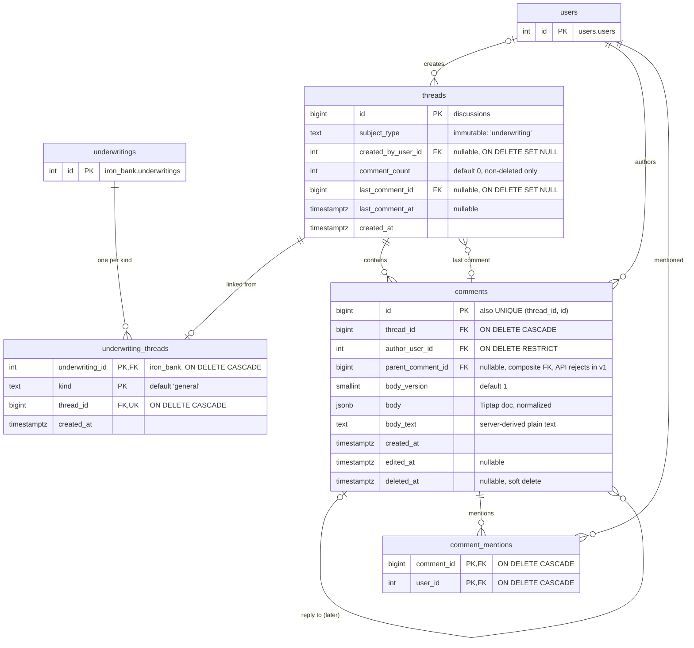

# Underwriting Discussions: Final Design (v1)

Status: **Schema applied; application code in progress** · Supersedes `underwriting_discussions_opus.md`
and `underwriting_discussions_astra.md`.

> The two drafts are kept for history only. Where they disagree with this
> document (exclusive-arc subject columns, `RESTRICT` delete policy, flat body
> nodes, `thread_participants.reason`, tables in `iron_bank`), **this document
> wins**. §11 records why the alternatives were rejected.

Comment threads on underwritings, with @mentions. The data model is designed so
that replies, multiple threads, unread counts, notifications, attachments, and
discussions on other entities (markets, listings) can be added later without
reshaping the v1 tables.

---

## 1. Decisions

| Topic | Decision |
|---|---|
| Schema | New `discussions` schema with its own Alembic branch (fifth branch). |
| Code location | `app/core/discussions/`, following the `app/core/reference_data/` precedent. Domains may import it; it never imports a domain. |
| Subject linking | Each domain owns a link table (`iron_bank.underwriting_threads`). `discussions.threads` never references a domain table. |
| Threads per underwriting | One `general` thread per underwriting in v1. Other `kind` values later need no table change. |
| Thread ownership | Per underwriting **row/version**. A duplicated underwriting starts with an empty discussion. |
| Ordering | `(created_at, id)`, newest first, with the codebase's page-based pagination (`page`, `PageSize`). No linked list. |
| Replies | `parent_comment_id` column ships in v1; the API rejects non-null values until replies launch. |
| Body format | Tiptap / ProseMirror JSON (strict subset), stored in `body jsonb`, with a separate `body_version` column. |
| Mentions | Derived server-side from the body; stored in `comment_mentions`. Clients never send a mention list. |
| Counters | `comment_count`, `last_comment_id`, `last_comment_at` stored on `threads`, updated in the same transaction. Never on `underwritings`. |
| Edit / delete | Author only. Delete is a soft delete. |
| Underwriting deleted | Cascades to the link row only. The thread and its comments are kept (unlinked). |

### Layering rule

```
iron_bank (domain) ──imports──▶ app/core/discussions ──imports──▶ app/core (database, config)
        │                               ▲
        └── owns iron_bank.underwriting_threads (FK → discussions.threads)

app/dependencies.py ──wires──▶ UserLookup implementation from app/users
```

- `app/core/discussions` never imports `app.iron_bank`, `app.users`, or any other domain.
- Domains talk to discussions **only through `DiscussionService`** and its schemas. No
  domain repository may import discussion models or join discussion tables.
  This keeps discussions extractable into a separate service later.
- Discussions needs user data (mention validation, names in responses). It
  defines a `UserLookup` protocol; `app/dependencies.py` (which already imports
  from `app.users`) provides the implementation.

---

## 2. Data model (v1)



### 2.1 DDL (target state)

This is the schema the Alembic migrations must produce. Generate the migrations
from the SQLAlchemy models and compare them against this.

```sql
-- ── discussions.threads ─────────────────────────────────────────────────────
CREATE TABLE discussions.threads (
    id                  bigint GENERATED ALWAYS AS IDENTITY PRIMARY KEY,
    subject_type        text        NOT NULL,          -- app-validated enum: 'underwriting'
    created_by_user_id  integer     REFERENCES users.users(id) ON DELETE SET NULL,
    comment_count       integer     NOT NULL DEFAULT 0,
    last_comment_id     bigint,                        -- FK added after comments exists
    last_comment_at     timestamptz,
    created_at          timestamptz NOT NULL DEFAULT now(),
    CONSTRAINT ck_threads_comment_count_nonneg CHECK (comment_count >= 0)
);

-- ── discussions.comments ────────────────────────────────────────────────────
CREATE TABLE discussions.comments (
    id                 bigint GENERATED ALWAYS AS IDENTITY PRIMARY KEY,
    thread_id          bigint      NOT NULL REFERENCES discussions.threads(id) ON DELETE CASCADE,
    author_user_id     integer     NOT NULL REFERENCES users.users(id) ON DELETE RESTRICT,
    parent_comment_id  bigint,
    body_version       smallint    NOT NULL DEFAULT 1,
    body               jsonb       NOT NULL,
    body_text          text        NOT NULL,
    created_at         timestamptz NOT NULL DEFAULT now(),
    edited_at          timestamptz,
    deleted_at         timestamptz,
    CONSTRAINT uq_comments_thread_id_id UNIQUE (thread_id, id),
    -- Replies must stay in the same thread. NO ACTION (default), not RESTRICT,
    -- so a thread delete can cascade through all its comments in one statement.
    CONSTRAINT fk_comments_parent_same_thread
        FOREIGN KEY (thread_id, parent_comment_id)
        REFERENCES discussions.comments (thread_id, id),
    CONSTRAINT ck_comments_parent_not_self
        CHECK (parent_comment_id IS NULL OR parent_comment_id <> id),
    CONSTRAINT ck_comments_body_object  CHECK (jsonb_typeof(body) = 'object'),
    CONSTRAINT ck_comments_body_version CHECK (body_version >= 1)
);

CREATE INDEX idx_comments_thread_timeline ON discussions.comments (thread_id, created_at, id);
CREATE INDEX idx_comments_author          ON discussions.comments (author_user_id);

-- Circular reference: threads → its latest comment.
ALTER TABLE discussions.threads
    ADD CONSTRAINT fk_threads_last_comment
    FOREIGN KEY (last_comment_id) REFERENCES discussions.comments(id) ON DELETE SET NULL;

-- ── discussions.comment_mentions ────────────────────────────────────────────
CREATE TABLE discussions.comment_mentions (
    comment_id  bigint  NOT NULL REFERENCES discussions.comments(id) ON DELETE CASCADE,
    user_id     integer NOT NULL REFERENCES users.users(id)          ON DELETE CASCADE,
    PRIMARY KEY (comment_id, user_id)
);

-- "Comments that mention me", newest first (comment ids are monotonic).
CREATE INDEX idx_comment_mentions_user ON discussions.comment_mentions (user_id, comment_id);

-- ── iron_bank.underwriting_threads ──────────────────────────────────────────
CREATE TABLE iron_bank.underwriting_threads (
    underwriting_id  integer     NOT NULL REFERENCES iron_bank.underwritings(id) ON DELETE CASCADE,
    kind             text        NOT NULL DEFAULT 'general',
    thread_id        bigint      NOT NULL REFERENCES discussions.threads(id)     ON DELETE CASCADE,
    created_at       timestamptz NOT NULL DEFAULT now(),
    PRIMARY KEY (underwriting_id, kind),
    CONSTRAINT uq_underwriting_threads_thread UNIQUE (thread_id)
);
```

**Notes**

- `subject_type` and `kind` are plain `text` validated by Python enums, not
  `CHECK` constraints, so adding a subject type or kind never alters a table.
- `ON DELETE RESTRICT` on the comment author: users are soft-deleted
  (`users.is_deleted`). Hard-deleting a user who has commented must be a
  deliberate act.
- Deleting an underwriting removes only its link row. The thread survives
  without a subject. If unlinked threads turn out to be unwanted, switch the
  link's underwriting FK to `RESTRICT`.
- `uq_underwriting_threads_thread` enforces one underwriting per thread
  (per-version discussions).

### 2.2 SQLAlchemy model notes

- `threads.id` and `comments.id` use `BigInteger, Identity(always=True)`.
- `threads.last_comment_id` declares its FK with `use_alter=True` and the name
  `fk_threads_last_comment`. The migration creates it after `comments`.
- The composite reply FK and `UNIQUE (thread_id, id)` are declared in
  `Comment.__table_args__`.
- `UnderwritingThread` references `"discussions.threads.id"` by string. It
  imports the `app.core.discussions.models` module only so that table is
  registered in the shared metadata; it does not use the `Thread` class.

---

## 3. Migrations (applied)

The tables in §2 exist. The migrations were applied with
`alembic upgrade discussions@head` followed by `alembic upgrade iron_bank@head`.

| File | Contents |
|---|---|
| `app/core/discussions/models.py` | `Thread`, `Comment`, `CommentMention` |
| `app/iron_bank/models/underwriting_thread.py` | `UnderwritingThread` link model |
| `migrations/versions/356bce2d2f9d_init_discussions.py` | `discussions` branch base; creates the schema |
| `migrations/versions/26237c59cd08_create_discussions_tables.py` | threads, comments, comment_mentions, indexes, circular FK; depends on the users table migration |
| `migrations/versions/a7eb071e1428_create_underwriting_threads.py` | iron_bank link table; depends on the discussions tables migration |

Version state after applying:

| Branch | Revision |
|---|---|
| iron_bank | `a7eb071e1428` (previously `e9b17c4d3a82`) |
| discussions | `26237c59cd08`, implied by the iron_bank row because of `depends_on` |
| markets | `b35b5049dbae` (unchanged) |
| reference | `a7c3e1f20b45` (unchanged) |
| users | `f1a4d7b62c30` (unchanged) |

`markets.alembic_version` therefore holds four rows, not five. The next
discussions migration will add its own row again.

To roll back only the link table: `uv run alembic downgrade iron_bank@e9b17c4d3a82`.

---

## 4. Comment body

### 4.1 Storage

The body stores the editor's `getJSON()` output, **after server-side
normalization**. `body_version` is stored in its own column so `body` is pure
Tiptap JSON. The FE can send `editor.getJSON()` unchanged and load a stored
body back with `editor.commands.setContent(body)` when editing.

```json
{
  "type": "doc",
  "content": [
    {
      "type": "paragraph",
      "content": [
        { "type": "text", "text": "ADR looks high vs the comp set, " },
        { "type": "mention", "attrs": { "id": 42 } },
        { "type": "text", "text": ". See " },
        { "type": "text", "text": "AirDNA export",
          "marks": [{ "type": "link", "attrs": { "href": "https://example.com/x" } }] }
      ]
    },
    {
      "type": "bulletList",
      "content": [
        { "type": "listItem", "content": [
          { "type": "paragraph", "content": [{ "type": "text", "text": "Occupancy is fine" }] }
        ]}
      ]
    }
  ]
}
```

### 4.2 Allowed content (body_version 1)

| Kind | Allowed | Rejected (v1) |
|---|---|---|
| Block nodes | `doc` (root), `paragraph`, `bulletList`, `orderedList` (`attrs.start`), `listItem` | `heading`, `blockquote`, `codeBlock`, `horizontalRule`, anything else |
| Inline nodes | `text`, `hardBreak`, `mention` | `image`, `emoji`, anything else |
| Marks | `bold`, `italic`, `strike`, `underline`, `code`, `link` | anything else |

Containment rules:

- `doc` → one or more of `paragraph | bulletList | orderedList`
- `paragraph` → zero or more inline nodes
- `bulletList` / `orderedList` → one or more `listItem`
- `listItem` → `paragraph`, optionally followed by nested lists; max list depth **3**

**The FE comment composer must enable exactly these extensions.** Tiptap v3's
StarterKit enables headings, blockquotes, code blocks, and horizontal rules by
default; disable them for the composer. When either side changes, change both.

### 4.3 Server pipeline (create and edit)

Lives in `app/core/discussions/body/`. Runs inside the same transaction as the
write.

1. **Enforce limits on the raw JSON, before parsing.** An iterative scan
   follows `content` arrays and stops at the first limit exceeded, so an
   oversized or deeply nested payload never reaches Pydantic. It ignores
   malformed shapes; those are the parser's job. The FE composer enforces the
   same limits for UX, but the BE is authoritative.

   | Limit | Value |
   |---|---|
   | Total text characters | 10,000 |
   | Total nodes (marks excluded) | 1,000 |
   | Distinct mentions (`42` and `"42"` count once) | 20 |
   | List nesting depth | 3 |
   | Node depth (doc → 3 × list/listItem → paragraph → inline) | 8 |

2. **Parse.** Pydantic discriminated unions per node type, selected by
   `body_version` (`BODY_SCHEMAS = {1: DocV1}`).
   - Unknown **node or mark types** → `422`. They indicate FE/BE drift.
   - Unknown **attributes** on known nodes are dropped. These are editor noise.
     - `mention.attrs`: keep `id` only, coerced `"42"` → `42`. Drop `label`,
       `mentionSuggestionChar`.
     - `link.attrs`: keep `href` only, must be `http`/`https`. Drop `target`,
       `rel`, `class`.
3. **Walk.** One generator visits every parsed node; mention ids and
   emptiness come from it.
4. **Reject empty comments.** Non-whitespace text or at least one mention is
   required. Tiptap's empty editor (`doc` → empty `paragraph`) counts as empty.
   (When attachments ship: or at least one attachment.)
5. **Resolve mentions.** Collect distinct ids → one `UserLookup` call. Any id
   that is missing or has `is_deleted = true` → `422` listing the ids. Never
   drop a mention silently. (`is_deleted` is nullable; treat `NULL` as active.)
6. **Derive `body_text`.** Text as-is; mention → `@First Last` (fallback:
   email, then `@unknown`); `hardBreak` → newline; one line per paragraph,
   joined with `\n` (no trailing newline); list items prefixed `- ` or `N. `
   (from `attrs.start`), indented two spaces per nesting level.
7. **Persist** the normalized body (`model_dump(exclude_none=True)`), not the
   raw request.

### 4.4 Versioning

- **Additive changes** (new node type, new mark, new optional attribute) extend
  version 1. Old rows remain valid.
- **Breaking changes** (renaming or retyping a stored field, switching editor
  format) add a new model and version. Either keep both parsers keyed on
  `body_version`, or run a data migration that rewrites old rows and bumps
  their version.
- **Writes are strict, reads are tolerant.** Removing a feature from the
  composer means rejecting it on write while still reading it from old rows.

---

## 5. Behaviour

**Transactions.** `DiscussionService` and `DiscussionRepository` never commit
(unlike most repositories in this codebase), and neither do the iron_bank
discussion service or link repository. The controllers commit: the iron_bank
`UnderwritingCommentController` for `POST /iron-bank/underwritings/{id}/comments`,
the discussions controller for `/comments/{id}`. This is what lets §5.1 create the thread, the link row and
the first comment atomically on one session.

### 5.1 Thread creation (lazy)

Reading an underwriting with no thread returns an empty page and creates
nothing. The first comment creates the thread, in one transaction, driven by
the iron_bank service:

1. Look up `underwriting_threads` for `(underwriting_id, 'general')`. Found → use it.
2. Otherwise `DiscussionService.create_thread(subject_type="underwriting", created_by=user)`.
3. `INSERT INTO iron_bank.underwriting_threads ... ON CONFLICT (underwriting_id, kind) DO NOTHING RETURNING thread_id`.
4. If no row returned (a concurrent request won), delete the thread created in
   step 2 and re-read the link. If the link is gone too (the underwriting was
   deleted meanwhile), return `404`.
5. Create the comment on the resulting thread.

Do not lock the `underwritings` row for this. It is a wide, hot row. The
existence check uses `UnderwritingRepository.exists()`, not `get_by_id()`
(which loads five child tables).

If the insert in step 3 meets another transaction's uncommitted link,
Postgres waits for that transaction and then reports the conflict, so the
loser always re-reads a committed link. If the comment fails validation after
steps 2–3, nothing is committed and the new thread and link roll back with it.
Both behaviours are covered by `tests/iron_bank/test_underwriting_discussion_db.py`
(five concurrent first comments; the test asserts at least one lost the race).

### 5.2 Create comment

In one transaction:

1. Run the body pipeline (§4.3).
2. Reject non-null `parent_comment_id` with `422` (until replies ship).
3. Insert the comment; insert one `comment_mentions` row per distinct user.
4. `UPDATE threads SET comment_count = comment_count + 1, last_comment_id = :id, last_comment_at = :created_at WHERE id = :thread_id`.

### 5.3 Edit comment

- Author only, otherwise `403`. Deleted comments cannot be edited (`404`).
- Re-run the body pipeline; replace the comment's mention rows; set `edited_at`.
- Counters are unchanged.

### 5.4 Delete comment

- Author only, otherwise `403`. Soft delete: set `deleted_at`.
- `comment_count = comment_count - 1`.
- If it was `last_comment_id`, recompute `last_comment_id` / `last_comment_at`
  from the newest non-deleted comment (or `NULL`).
- Mention rows are kept. Readers exclude deleted comments.
- Content is retained in the database; erasure rules are a separate decision.

### 5.5 List comments

- Page-based, like every other list endpoint: `page` (1-based) and
  `page_size: PageSize` (25 / 50 / 100, default 25, from `app/core/enums.py`).
  `ORDER BY created_at DESC, id DESC OFFSET (page - 1) * page_size LIMIT page_size`.
- `total` comes from `COUNT(*)` on the thread's comments, **including** deleted
  placeholders, so `threads.comment_count` (non-deleted only) cannot be used.
- A comment posted between page loads shifts later pages by one, so page 2 can
  repeat the last item of page 1. The FE de-duplicates by `id`. See §11.
- Deleted comments are returned as placeholders (`is_deleted: true`, `body: null`).
- Users for the page are resolved in **one** lookup: authors from the comment
  rows plus mentioned users from `comment_mentions` for the page's comment ids.
  Bodies are not parsed for this.

### 5.6 Summaries on the underwritings list

The underwritings list response gains a `discussion` object per row. Two
queries, no cross-domain join:

1. The iron_bank list query (unchanged) plus its own link table → `thread_id` per underwriting.
2. `DiscussionService.get_summaries(thread_ids)` → reads stored counters from `threads`.

```json
"discussion": { "thread_id": 88, "comment_count": 4, "last_comment_at": "2026-10-08T14:02:00Z" }
```

`thread_id: null, comment_count: 0` when no thread exists.

---

## 6. API

All routes sit behind the global `get_current_user` guard. The author is always
the authenticated user and is never accepted from the client.

| Method | Path | Owner | Purpose |
|---|---|---|---|
| `GET` | `/iron-bank/underwritings/{id}/comments?page=&page_size=` | iron_bank router | List comments (`200`) |
| `POST` | `/iron-bank/underwritings/{id}/comments` | iron_bank router | Create comment, creating the thread lazily (`201`) |
| `PATCH` | `/comments/{comment_id}` | discussions router | Edit (author only) |
| `DELETE` | `/comments/{comment_id}` | discussions router | Soft delete (author only) |

**Create request**

```json
{
  "body_version": 1,
  "body": { "type": "doc", "content": [ "..." ] },
  "parent_comment_id": null
}
```

**List response**

```json
{
  "items": [
    {
      "id": 981,
      "thread_id": 88,
      "author_user_id": 7,
      "parent_comment_id": null,
      "body_version": 1,
      "body": { "type": "doc", "content": [ "..." ] },
      "created_at": "2026-10-08T14:02:00Z",
      "edited_at": null,
      "is_deleted": false
    }
  ],
  "users": {
    "7":  { "id": 7,  "first_name": "Sam",  "last_name": "Lee", "email": "sam@…", "is_deleted": false },
    "42": { "id": 42, "first_name": "Jane", "last_name": "Doe", "email": "jane@…", "is_deleted": false }
  },
  "total": 2,
  "page": 1,
  "page_size": 25,
  "pages": 1
}
```

Create and edit return the single comment in the same shape, with its own
`users` map.

**Errors**

| Case | Status |
|---|---|
| Underwriting not found | `404` |
| Comment not found or deleted | `404` |
| Not the author (edit/delete) | `403` |
| Invalid body (shape, unknown node/mark, limits, empty) | `422` with the failing path |
| Invalid mention (unknown or deleted user) | `422` with the user ids |
| Non-null `parent_comment_id` | `422` |
| Unknown request field (e.g. `author_user_id`) | `422` (requests use `extra="forbid"`) |

422 bodies use FastAPI's validation shape, `{"detail": [{"loc", "msg", "type", "ctx"?}]}`:

- Body errors: `loc` starts at `"body"` (e.g. `["body", "content", 0, ...]`),
  or `["body_version"]` for an unsupported version.
- Mentions: `{"loc": ["body"], "type": "invalid_mention", "ctx": {"user_ids": [99]}}`.
- Replies: `{"loc": ["parent_comment_id"], "type": "replies_not_supported"}`.

`DELETE` returns `204` with no body. `app.core.discussions.controller.discussion_http_error`
does this mapping and is reused by the iron_bank comment routes.

---

## 7. Frontend contract

The editor is the app's `RichTextEditor` component, defined in the frontend
repo at `components/rich-text-editor.tsx` (around line 41). It is built on
Tiptap v3 (`@tiptap/react`, running on ProseMirror). This backend repo cannot
see the frontend code; confirm the points below there.

- **Output format.** Shared editor components often report changes as HTML.
  Check what `RichTextEditor` emits; if it only emits HTML, add a prop or
  callback that returns `editor.getJSON()` for the comment composer.
- **Composer.** Send `editor.getJSON()`, never HTML. Enable exactly the
  extensions in §4.2. Mentions come from `@tiptap/extension-mention`; the picker
  is fed by `GET /users`, filtered client-side. Only a picked user becomes a
  mention node; typed `@Name` is plain text.
- **Editing.** Load the stored body with `setContent(body)`. Show edit and
  delete only when `author_user_id` is the current user.
- **Rendering.** Use Tiptap's static renderer (no editor instance per comment),
  mapping:

  | Node / mark | Render |
  |---|---|
  | `paragraph`, lists | `<p>`, `<ul>`/`<ol>`/`<li>` |
  | `text` + marks | text wrapped in `strong` / `em` / `s` / `u` / `code` |
  | `link` | `<a target="_blank" rel="noopener noreferrer">` |
  | `mention` | chip with the current name from `users[id]`; "Former user" if missing or deleted; highlighted if it is the current user |
  | `hardBreak` | `<br>` |
  | unknown node | render inner text if any, otherwise skip |

- Never render comment content as raw HTML.
- Deleted comments render as a "Comment deleted" placeholder.

---

## 8. Code layout

```
app/core/discussions/
├── models.py          # Thread, Comment, CommentMention
├── enums.py           # SubjectType, ThreadKind
├── interfaces.py      # UserLookup protocol, UserRef
├── body/
│   ├── nodes.py       # Pydantic node/mark models, BODY_SCHEMAS
│   ├── walker.py      # walk(), mention ids, limits, emptiness
│   ├── text.py        # body_text derivation
│   ├── errors.py      # InvalidBodyError, InvalidMentionError (→ 422)
│   └── pipeline.py    # process_body(): steps 1–7 of §4.3
├── schemas.py         # request/response models, DiscussionSummary
├── exceptions.py      # CommentNotFound (404), NotCommentAuthor (403), RepliesNotSupported (422)
├── repository.py      # never commits; caller owns the transaction
├── service.py         # DiscussionService: the only entry point for domains; never commits
├── controller.py      # commits for its own routes; discussion_http_error() error → HTTP mapping
└── router.py          # PATCH/DELETE /comments/{id}; registered in app/__init__.py

app/iron_bank/
├── models/underwriting_thread.py
├── repositories/underwriting_thread_repository.py  # link table only; ON CONFLICT insert; never commits
├── repositories/underwriting_repository.py         # + exists()
├── services/underwriting_discussion_service.py     # lazy creation, list/create orchestration
├── controllers/underwriting_comment_controller.py  # commits on create; reuses discussion_http_error
└── router.py                                       # GET/POST /iron-bank/underwritings/{id}/comments

app/dependencies.py    # get_user_lookup(): UserLookup backed by app.users
app/__init__.py        # include the discussions router
```

**Tests** (`tests/core/discussions/`, `tests/iron_bank/`):

- Body parsing: every allowed node/mark, rejected nodes, attribute stripping,
  mention id coercion, link scheme, limits, empty-doc detection, `body_text` output.
- Service: create/edit/delete counters, last-comment recompute on delete,
  mention row replacement on edit, author-only checks.
- Lazy creation: concurrent first comments end with one thread and one link.
- Real-DB tests (`tests/core/discussions/test_discussion_db.py`,
  `tests/iron_bank/test_underwriting_discussion_db.py`) are opt-in:
  `RUN_DB_TESTS=1 uv run pytest tests/core/discussions/test_discussion_db.py tests/iron_bank/test_underwriting_discussion_db.py`.
  They use `DATABASE_URL`, refuse the production project ref, and delete the
  threads they create. Point them at the dev Supabase project only.

---

## 9. Deferred features

None of these change the v1 tables, except the optional `title` column.

| Feature | Work when it ships |
|---|---|
| Replies | Code only: accept `parent_comment_id`, validate same thread, return it. |
| More threads per underwriting | Code only for new `kind` values. Named threads: add `threads.title` (nullable). |
| Unread counts | New `thread_participants` table, `POST /threads/{id}/read`, backfill. See §10.1. |
| Notifications | `thread_participants`, a transactional outbox, a polling worker, and a `notifications` table. See §10.2. |
| Attachments | `comment_attachments (comment_id, media_id, position)` with `UNIQUE (comment_id, position)`, once the media table's name and id type are known. |
| Other subjects (markets, listings) | One link table in that domain's schema, a `SubjectType` value, and a subject resolver. See §10.3. |
| User search for mentions | Add a search parameter to `GET /users` if the user list grows. |

---

## 10. Design notes for deferred features

These are settled designs, recorded so they are not re-derived later.

### 10.1 Read state and unread counts

**Table.** One row per user per thread. It combines read state and
notification preference; an earlier draft's `reason` and `muted` columns are
dropped (one reason per row cannot represent "mentioned, then posted", and
mute is covered by the preference).

```sql
CREATE TABLE discussions.thread_participants (
    thread_id                bigint  NOT NULL REFERENCES discussions.threads(id) ON DELETE CASCADE,
    user_id                  integer NOT NULL REFERENCES users.users(id)        ON DELETE CASCADE,
    last_read_comment_id     bigint  REFERENCES discussions.comments(id)        ON DELETE SET NULL,
    notification_preference  text,   -- NULL = app default; else 'all' | 'mentions_only' | 'none'
    created_at               timestamptz NOT NULL DEFAULT now(),
    updated_at               timestamptz NOT NULL DEFAULT now(),
    PRIMARY KEY (thread_id, user_id),
    CONSTRAINT ck_thread_participants_pref
        CHECK (notification_preference IS NULL
               OR notification_preference IN ('all', 'mentions_only', 'none'))
);
CREATE INDEX idx_thread_participants_user ON discussions.thread_participants (user_id);
```

- `notification_preference` is nullable so the default policy can change
  without a backfill. Having authored a comment never sets it.
- Rows exist for readers too, not only authors and mentioned users, because
  unread tracking needs a pointer for anyone who opens the thread.
- `updated_at` changes on every read; do not treat it as "preference changed".

**What triggers a read update.** The database cannot know what a user saw, so
the frontend reports it:

1. When the thread opens and comments load, the FE reports the newest comment
   it displayed. This is the v1 behaviour.
2. For long threads, the FE may instead report the newest comment scrolled into
   view, debounced to once every second or two.
3. When a user posts, the comment service moves their pointer to the new
   comment in the same transaction, so their own comment is never unread.

**Endpoint.** A dedicated write, not a side effect of `GET`. A `GET` that marks
threads read would fire on browser prefetches and list-page summary loads.

```
POST /threads/{thread_id}/read      { "last_read_comment_id": 981 }
```

```sql
INSERT INTO discussions.thread_participants (thread_id, user_id, last_read_comment_id)
VALUES (:thread_id, :user_id, :comment_id)
ON CONFLICT (thread_id, user_id) DO UPDATE
SET last_read_comment_id = GREATEST(
        discussions.thread_participants.last_read_comment_id,
        EXCLUDED.last_read_comment_id),
    updated_at = now();
```

- The upsert creates the row for first-time readers.
- `GREATEST` makes the pointer forward-only, so out-of-order requests from two
  tabs cannot move it back. A future "mark as unread" gets its own endpoint.
- The service verifies the comment belongs to the thread before writing.
- Ids, not timestamps: ids are unique and increasing; timestamps can tie.

**Reading it.**

- Unread count: non-deleted comments in the thread with `id > last_read_comment_id`
  and `author_user_id <> :me`.
- Cheap "has unread" flag: `threads.last_comment_id > last_read_comment_id`, no counting.
- The pointer means "read up to here", not per-comment receipts. That matches
  how threads are read and is enough for badges.

**Known edge case.** Identity ids are assigned at insert, not commit. Two
near-simultaneous posts can become visible out of id order, so a reader in
that instant may get a pointer past a comment they never saw. Accepted for
comments; no special handling.

**Backfill when it ships.** Insert a row for each comment author and each
mentioned user per thread, with `last_read_comment_id` set to the newest
comment for authors and `NULL` for mentioned users.

### 10.2 Notifications

No message queue is needed initially. The codebase has none today; batch
workflows use the `iron_bank.jobs` table plus FastAPI `BackgroundTasks`.
Notifications follow the same Postgres-first approach.

**1. Outbox.** The comment transaction also inserts an event row:

```
event_type: "comment.created"   payload: { "comment_id": 981, "thread_id": 88 }
```

Writing it in the same transaction guarantees the comment and its event are
saved together or not at all. Edits emit `comment.edited` with the newly added
mention ids only.

**2. Worker.** A background process polls unprocessed events every few seconds:

```
recipients = thread_participants for the thread
           ∪ users in comment_mentions for the comment

for each recipient:
    skip the actor (comment author)
    pref = notification_preference, or the app default when NULL
    'none'          → skip
    'mentions_only' → notify only if mentioned in this comment
    'all'           → notify
    recheck the recipient still has access to the subject
```

It inserts one `notifications` row per recipient, then marks the event
processed. A crash mid-way leaves the event unprocessed and it is retried, so
notification inserts must be idempotent: `UNIQUE (event_id, recipient_user_id)`
with `ON CONFLICT DO NOTHING`.

**3. Notifications table.** What users see in the bell:

```
notifications (id, event_id, recipient_user_id, event_type, thread_id, comment_id,
               reason,            -- 'mentioned' | 'thread_activity'
               read_at, created_at)
```

- Marking a thread read (§10.1) also sets `read_at` on that user's
  notifications for the thread, so the bell and the thread never disagree.
- Email, Slack, or push delivery are later steps in the same worker.
- A message queue (SQS, Redis, RabbitMQ) becomes useful only if other services
  consume these events or volume grows. The worker would then publish outbox
  events to the queue; the comment code does not change.

### 10.3 Other subjects

Adding markets or listings:

1. A link table in that domain's schema with the same shape as
   `underwriting_threads` (`<subject>_id`, `kind`, `thread_id UNIQUE`).
2. A new `SubjectType` value. No change to `discussions.threads`.
3. A subject resolver the domain registers with discussions, mapping
   `thread_id` → subject (id, label, URL) for features like a "mentions of me"
   feed and notification links. Discussions never queries a domain's link
   table directly.
4. If per-entity access control arrives, the same registry holds a per-subject
   permission check.

### 10.4 Extracting discussions into a separate service

Kept cheap by the layering rule (§1). If it ever happens:

- Cross-schema FKs (to users, and from domain link tables) are dropped;
  existence checks move to code and cascades become events
  (e.g. "underwriting deleted").
- `DiscussionService` calls become HTTP calls behind the same interface.
  Domain code is unchanged because it never joined discussion tables.
- Operations spanning both sides (e.g. creating a thread and its link row)
  stop being atomic and need idempotent retries.

---

## 11. Rejected alternatives

| Alternative | Why rejected |
|---|---|
| Linked list of comments (`reference_id` → previous comment) | Concurrent posts fork the chain; reads need a recursive CTE; pagination breaks; deletes break the chain. Order is intrinsic in `(created_at, id)`. Replies are a separate concept (`parent_comment_id`). |
| Cursor (keyset) pagination on `(created_at, id)` | Stable under concurrent inserts, but every other list endpoint uses `page` + `PageSize` with `total`/`pages`, and the FE already handles that shape. Threads are small, so a page shifting by one when someone posts is rare and handled by de-duplicating on `id`. Revisit if threads grow long or the FE moves to infinite scroll. |
| Polymorphic `subject_type` + `subject_id` on threads | No FK, no cascade, and `subject_id` must be `text` to hold int, uuid, and text ids. |
| Exclusive arc (one nullable FK column per subject on `threads` + `CHECK num_nonnulls(...) = 1`) | Real FKs, but `discussions.threads` would reference every domain's tables, so core would depend on domains. Each new subject alters the shared threads table. The CHECK also forces delete cascade or restrict, so history cannot outlive the subject. Link tables invert the dependency. Trade-off accepted: no DB guarantee of exactly one link per thread (enforced by creating both in one service call) and reverse lookup needs a resolver. |
| All tables in `iron_bank` (`underwriting_threads`, `underwriting_comments`, …) | Simplest today, but discussions on markets or listings would live in `iron_bank` or need moving. |
| Top-level `app/discussions/` domain | Domains could not import it without an exception to "never import between domains". Possible later if the team defines a shared-modules layer in `CLAUDE.md`. |
| One thread per underwriting enforced by `UNIQUE (underwriting_id)` only | Removing it later leaves the lazy-creation upsert without a target. Keying the link on `(underwriting_id, kind)` lets new kinds coexist with the general thread. |
| Thread shared across underwriting versions (series) | Product decision: each version gets its own discussion. Allowing sharing later means dropping `uq_underwriting_threads_thread`. |
| `comment_count` on `iron_bank.underwritings` | Wide, frequently edited row: extra lock contention and a polluted `updated_at`. Counters live on `threads`. |
| Joining discussion tables inside the underwritings list query | Couples iron_bank to discussion tables and blocks extraction. Two queries instead: the list, then `DiscussionService.get_summaries(thread_ids)`. |
| `RESTRICT` on underwriting → discussion | Inconsistent with other underwriting children (line items cascade). The link cascades; the thread survives. |
| Plain text with inline tokens (`Hey @[user:42]`) | Users can forge tokens by typing them, parsing is ambiguous, and validation is ad hoc. |
| Flat node list with `\n` inside text | No real paragraphs; does not match Tiptap/ProseMirror output. |
| Custom block format (`blocks` / `children`) | Invented field names; the FE would have to convert Tiptap output both ways. |
| Storing raw Tiptap output, or HTML | Raw output carries editor noise (mention labels, link `target`/`class`); HTML is an injection risk and hard to validate. The server stores normalized JSON. |
| `version` inside the body JSON | The FE would have to wrap and unwrap the editor JSON. `body_version` is a column instead. |
| Client-sent mention list | Can disagree with the body. Mentions are derived from the body server-side. |
| Storing mentioned users' names in the body | Stale after renames. Names are resolved at read time from the `users` map. |
| `media_ids int[]` on comments | No FK integrity, no cascade, poor reverse lookup, no per-attachment metadata. Join table instead. |
| Marking threads read inside `GET` | Fires on prefetches and summary loads. Dedicated `POST /threads/{id}/read`. |
| Separate `thread_subscriptions` and `thread_participants` tables | Same key, small scale: one row per user per thread holds both read state and preference. Split only if subscriptions grow (channels, digests). |
| Message queue for v1 notifications | No queue exists in the stack; an outbox polled from Postgres is enough at this scale and keeps comment writes and events atomic. |

---

## 12. Open items

- **Link delete policy.** v1 cascades the link only and keeps orphaned threads.
  Revisit if they become a problem.
- **Folder placement.** v1 uses `app/core/discussions/`. Moving to a top-level
  shared-modules layer is possible later if the team updates the import rules
  in `CLAUDE.md`.
- **Limits.** The values in §4.3 are starting points; adjust after real use.
