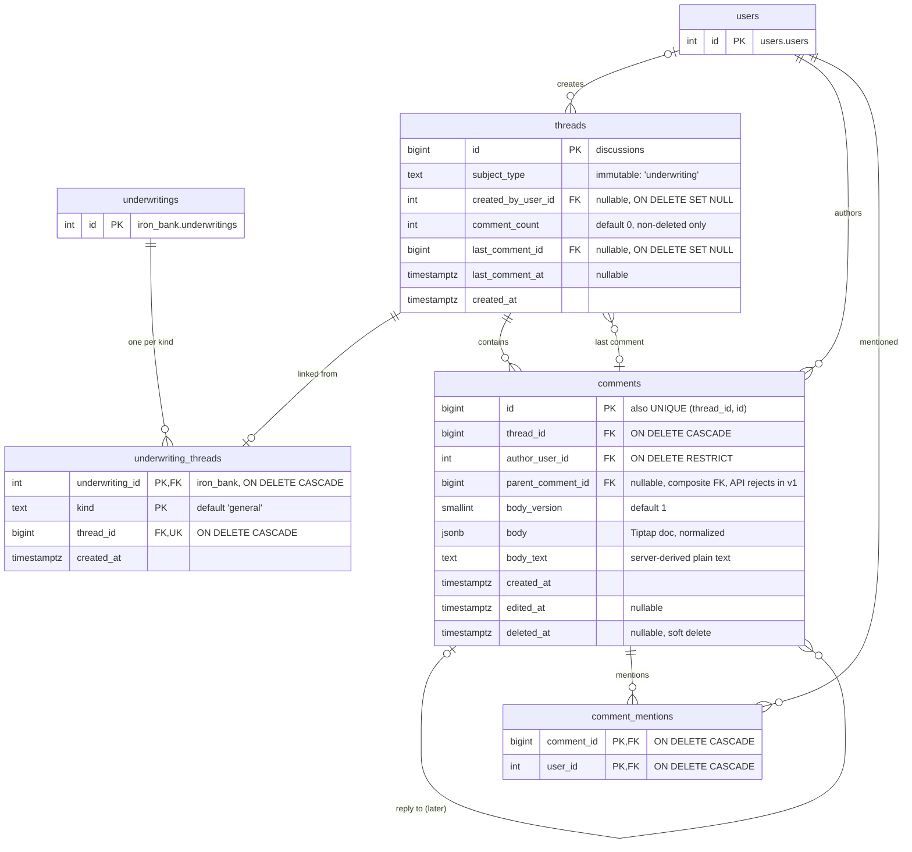

# Underwriting Discussions: Final Design (v1)

Status: **Schema applied; application code in progress** · Supersedes `underwriting_discussions_opus.md`
and `underwriting_discussions_astra.md`.

Comment threads on underwritings, with @mentions. The data model is designed so
that replies, multiple threads, unread counts, notifications, attachments, and
discussions on other entities (markets, listings) can be added later without
reshaping the v1 tables.

---

## 1. Decisions

| Topic | Decision |
|---|---|
| Schema | New `discussions` schema with its own Alembic branch (fifth branch). |
| Code location | `app/core/discussions/`, following the `app/core/reference_data/` precedent. Domains may import it; it never imports a domain. |
| Subject linking | Each domain owns a link table (`iron_bank.underwriting_threads`). `discussions.threads` never references a domain table. |
| Threads per underwriting | One `general` thread per underwriting in v1. Other `kind` values later need no table change. |
| Thread ownership | Per underwriting **row/version**. A duplicated underwriting starts with an empty discussion. |
| Ordering | `(created_at, id)` with keyset pagination. No linked list. |
| Replies | `parent_comment_id` column ships in v1; the API rejects non-null values until replies launch. |
| Body format | Tiptap / ProseMirror JSON (strict subset), stored in `body jsonb`, with a separate `body_version` column. |
| Mentions | Derived server-side from the body; stored in `comment_mentions`. Clients never send a mention list. |
| Counters | `comment_count`, `last_comment_id`, `last_comment_at` stored on `threads`, updated in the same transaction. Never on `underwritings`. |
| Edit / delete | Author only. Delete is a soft delete. |
| Underwriting deleted | Cascades to the link row only. The thread and its comments are kept (unlinked). |

### Layering rule

```
iron_bank (domain) ──imports──▶ app/core/discussions ──imports──▶ app/core (database, config)
        │                               ▲
        └── owns iron_bank.underwriting_threads (FK → discussions.threads)

app/dependencies.py ──wires──▶ UserLookup implementation from app/users
```

- `app/core/discussions` never imports `app.iron_bank`, `app.users`, or any other domain.
- Domains talk to discussions **only through `DiscussionService`** and its schemas. No
  domain repository may import discussion models or join discussion tables.
  This keeps discussions extractable into a separate service later.
- Discussions needs user data (mention validation, names in responses). It
  defines a `UserLookup` protocol; `app/dependencies.py` (which already imports
  from `app.users`) provides the implementation.

---

## 2. Data model (v1)



### 2.1 DDL (target state)

This is the schema the Alembic migrations must produce. Generate the migrations
from the SQLAlchemy models and compare them against this.

```sql
-- ── discussions.threads ─────────────────────────────────────────────────────
CREATE TABLE discussions.threads (
    id                  bigint GENERATED ALWAYS AS IDENTITY PRIMARY KEY,
    subject_type        text        NOT NULL,          -- app-validated enum: 'underwriting'
    created_by_user_id  integer     REFERENCES users.users(id) ON DELETE SET NULL,
    comment_count       integer     NOT NULL DEFAULT 0,
    last_comment_id     bigint,                        -- FK added after comments exists
    last_comment_at     timestamptz,
    created_at          timestamptz NOT NULL DEFAULT now(),
    CONSTRAINT ck_threads_comment_count_nonneg CHECK (comment_count >= 0)
);

-- ── discussions.comments ────────────────────────────────────────────────────
CREATE TABLE discussions.comments (
    id                 bigint GENERATED ALWAYS AS IDENTITY PRIMARY KEY,
    thread_id          bigint      NOT NULL REFERENCES discussions.threads(id) ON DELETE CASCADE,
    author_user_id     integer     NOT NULL REFERENCES users.users(id) ON DELETE RESTRICT,
    parent_comment_id  bigint,
    body_version       smallint    NOT NULL DEFAULT 1,
    body               jsonb       NOT NULL,
    body_text          text        NOT NULL,
    created_at         timestamptz NOT NULL DEFAULT now(),
    edited_at          timestamptz,
    deleted_at         timestamptz,
    CONSTRAINT uq_comments_thread_id_id UNIQUE (thread_id, id),
    -- Replies must stay in the same thread. NO ACTION (default), not RESTRICT,
    -- so a thread delete can cascade through all its comments in one statement.
    CONSTRAINT fk_comments_parent_same_thread
        FOREIGN KEY (thread_id, parent_comment_id)
        REFERENCES discussions.comments (thread_id, id),
    CONSTRAINT ck_comments_parent_not_self
        CHECK (parent_comment_id IS NULL OR parent_comment_id <> id),
    CONSTRAINT ck_comments_body_object  CHECK (jsonb_typeof(body) = 'object'),
    CONSTRAINT ck_comments_body_version CHECK (body_version >= 1)
);

CREATE INDEX idx_comments_thread_timeline ON discussions.comments (thread_id, created_at, id);
CREATE INDEX idx_comments_author          ON discussions.comments (author_user_id);

-- Circular reference: threads → its latest comment.
ALTER TABLE discussions.threads
    ADD CONSTRAINT fk_threads_last_comment
    FOREIGN KEY (last_comment_id) REFERENCES discussions.comments(id) ON DELETE SET NULL;

-- ── discussions.comment_mentions ────────────────────────────────────────────
CREATE TABLE discussions.comment_mentions (
    comment_id  bigint  NOT NULL REFERENCES discussions.comments(id) ON DELETE CASCADE,
    user_id     integer NOT NULL REFERENCES users.users(id)          ON DELETE CASCADE,
    PRIMARY KEY (comment_id, user_id)
);

-- "Comments that mention me", newest first (comment ids are monotonic).
CREATE INDEX idx_comment_mentions_user ON discussions.comment_mentions (user_id, comment_id);

-- ── iron_bank.underwriting_threads ──────────────────────────────────────────
CREATE TABLE iron_bank.underwriting_threads (
    underwriting_id  integer     NOT NULL REFERENCES iron_bank.underwritings(id) ON DELETE CASCADE,
    kind             text        NOT NULL DEFAULT 'general',
    thread_id        bigint      NOT NULL REFERENCES discussions.threads(id)     ON DELETE CASCADE,
    created_at       timestamptz NOT NULL DEFAULT now(),
    PRIMARY KEY (underwriting_id, kind),
    CONSTRAINT uq_underwriting_threads_thread UNIQUE (thread_id)
);
```

**Notes**

- `subject_type` and `kind` are plain `text` validated by Python enums, not
  `CHECK` constraints, so adding a subject type or kind never alters a table.
- `ON DELETE RESTRICT` on the comment author: users are soft-deleted
  (`users.is_deleted`). Hard-deleting a user who has commented must be a
  deliberate act.
- Deleting an underwriting removes only its link row. The thread survives
  without a subject. If unlinked threads turn out to be unwanted, switch the
  link's underwriting FK to `RESTRICT`.
- `uq_underwriting_threads_thread` enforces one underwriting per thread
  (per-version discussions).

### 2.2 SQLAlchemy model notes

- `threads.id` and `comments.id` use `BigInteger, Identity(always=True)`.
- `threads.last_comment_id` declares its FK with `use_alter=True` and the name
  `fk_threads_last_comment`. The migration creates it after `comments`.
- The composite reply FK and `UNIQUE (thread_id, id)` are declared in
  `Comment.__table_args__`.
- `UnderwritingThread` references `"discussions.threads.id"` by string. It
  imports the `app.core.discussions.models` module only so that table is
  registered in the shared metadata; it does not use the `Thread` class.

---

## 3. Migrations (applied)

The tables in §2 exist. The migrations were applied with
`alembic upgrade discussions@head` followed by `alembic upgrade iron_bank@head`.

| File | Contents |
|---|---|
| `app/core/discussions/models.py` | `Thread`, `Comment`, `CommentMention` |
| `app/iron_bank/models/underwriting_thread.py` | `UnderwritingThread` link model |
| `migrations/versions/356bce2d2f9d_init_discussions.py` | `discussions` branch base; creates the schema |
| `migrations/versions/26237c59cd08_create_discussions_tables.py` | threads, comments, comment_mentions, indexes, circular FK; depends on the users table migration |
| `migrations/versions/a7eb071e1428_create_underwriting_threads.py` | iron_bank link table; depends on the discussions tables migration |

Version state after applying:

| Branch | Revision |
|---|---|
| iron_bank | `a7eb071e1428` (previously `e9b17c4d3a82`) |
| discussions | `26237c59cd08`, implied by the iron_bank row because of `depends_on` |
| markets | `b35b5049dbae` (unchanged) |
| reference | `a7c3e1f20b45` (unchanged) |
| users | `f1a4d7b62c30` (unchanged) |

`markets.alembic_version` therefore holds four rows, not five. The next
discussions migration will add its own row again.

To roll back only the link table: `uv run alembic downgrade iron_bank@e9b17c4d3a82`.

---

## 4. Comment body

### 4.1 Storage

The body stores the editor's `getJSON()` output, **after server-side
normalization**. `body_version` is stored in its own column so `body` is pure
Tiptap JSON. The FE can send `editor.getJSON()` unchanged and load a stored
body back with `editor.commands.setContent(body)` when editing.

```json
{
  "type": "doc",
  "content": [
    {
      "type": "paragraph",
      "content": [
        { "type": "text", "text": "ADR looks high vs the comp set, " },
        { "type": "mention", "attrs": { "id": 42 } },
        { "type": "text", "text": ". See " },
        { "type": "text", "text": "AirDNA export",
          "marks": [{ "type": "link", "attrs": { "href": "https://example.com/x" } }] }
      ]
    },
    {
      "type": "bulletList",
      "content": [
        { "type": "listItem", "content": [
          { "type": "paragraph", "content": [{ "type": "text", "text": "Occupancy is fine" }] }
        ]}
      ]
    }
  ]
}
```

### 4.2 Allowed content (body_version 1)

| Kind | Allowed | Rejected (v1) |
|---|---|---|
| Block nodes | `doc` (root), `paragraph`, `bulletList`, `orderedList` (`attrs.start`), `listItem` | `heading`, `blockquote`, `codeBlock`, `horizontalRule`, anything else |
| Inline nodes | `text`, `hardBreak`, `mention` | `image`, `emoji`, anything else |
| Marks | `bold`, `italic`, `strike`, `underline`, `code`, `link` | anything else |

Containment rules:

- `doc` → one or more of `paragraph | bulletList | orderedList`
- `paragraph` → zero or more inline nodes
- `bulletList` / `orderedList` → one or more `listItem`
- `listItem` → `paragraph`, optionally followed by nested lists; max list depth **3**

**The FE comment composer must enable exactly these extensions.** Tiptap v3's
StarterKit enables headings, blockquotes, code blocks, and horizontal rules by
default; disable them for the composer. When either side changes, change both.

### 4.3 Server pipeline (create and edit)

Lives in `app/core/discussions/body/`. Runs inside the same transaction as the
write.

1. **Parse.** Pydantic discriminated unions per node type, selected by
   `body_version` (`BODY_SCHEMAS = {1: DocV1}`).
   - Unknown **node or mark types** → `422`. They indicate FE/BE drift.
   - Unknown **attributes** on known nodes are dropped. These are editor noise.
     - `mention.attrs`: keep `id` only, coerced `"42"` → `42`. Drop `label`,
       `mentionSuggestionChar`.
     - `link.attrs`: keep `href` only, must be `http`/`https`. Drop `target`,
       `rel`, `class`.
2. **Walk.** One generator visits every node; all derived data comes from it.
3. **Enforce limits.**

   | Limit | Value |
   |---|---|
   | Total text characters | 10,000 |
   | Total nodes | 1,000 |
   | Distinct mentions | 20 |
   | List nesting depth | 3 |

4. **Reject empty comments.** Non-whitespace text or at least one mention is
   required. Tiptap's empty editor (`doc` → empty `paragraph`) counts as empty.
   (When attachments ship: or at least one attachment.)
5. **Resolve mentions.** Collect distinct ids → one `UserLookup` call. Any id
   that is missing or has `is_deleted = true` → `422` listing the ids. Never
   drop a mention silently. (`is_deleted` is nullable; treat `NULL` as active.)
6. **Derive `body_text`.** Text as-is; mention → `@First Last` (fallback:
   email, then `@unknown`); `hardBreak` → newline; paragraph ends with newline;
   list items prefixed `- ` or `1. `, indented by depth.
7. **Persist** the normalized body (`model_dump(exclude_none=True)`), not the
   raw request.

### 4.4 Versioning

- **Additive changes** (new node type, new mark, new optional attribute) extend
  version 1. Old rows remain valid.
- **Breaking changes** (renaming or retyping a stored field, switching editor
  format) add a new model and version. Either keep both parsers keyed on
  `body_version`, or run a data migration that rewrites old rows and bumps
  their version.
- **Writes are strict, reads are tolerant.** Removing a feature from the
  composer means rejecting it on write while still reading it from old rows.

---

## 5. Behaviour

### 5.1 Thread creation (lazy)

Reading an underwriting with no thread returns an empty page and creates
nothing. The first comment creates the thread, in one transaction, driven by
the iron_bank service:

1. Look up `underwriting_threads` for `(underwriting_id, 'general')`. Found → use it.
2. Otherwise `DiscussionService.create_thread(subject_type="underwriting", created_by=user)`.
3. `INSERT INTO iron_bank.underwriting_threads ... ON CONFLICT (underwriting_id, kind) DO NOTHING RETURNING thread_id`.
4. If no row returned (a concurrent request won), delete the thread created in
   step 2 and re-read the link.
5. Create the comment on the resulting thread.

Do not lock the `underwritings` row for this. It is a wide, hot row.

### 5.2 Create comment

In one transaction:

1. Run the body pipeline (§4.3).
2. Reject non-null `parent_comment_id` with `422` (until replies ship).
3. Insert the comment; insert one `comment_mentions` row per distinct user.
4. `UPDATE threads SET comment_count = comment_count + 1, last_comment_id = :id, last_comment_at = :created_at WHERE id = :thread_id`.

### 5.3 Edit comment

- Author only, otherwise `403`. Deleted comments cannot be edited (`404`).
- Re-run the body pipeline; replace the comment's mention rows; set `edited_at`.
- Counters are unchanged.

### 5.4 Delete comment

- Author only, otherwise `403`. Soft delete: set `deleted_at`.
- `comment_count = comment_count - 1`.
- If it was `last_comment_id`, recompute `last_comment_id` / `last_comment_at`
  from the newest non-deleted comment (or `NULL`).
- Mention rows are kept. Readers exclude deleted comments.
- Content is retained in the database; erasure rules are a separate decision.

### 5.5 List comments

- Newest first, keyset pagination on `(created_at, id)`:
  `WHERE thread_id = :t AND (created_at, id) < (:c, :i) ORDER BY created_at DESC, id DESC LIMIT :n`.
- `limit` default 20, max 100. The cursor is an opaque encoding of `(created_at, id)`.
- Deleted comments are returned as placeholders (`is_deleted: true`, `body: null`).
- Users for the page are resolved in **one** lookup: authors from the comment
  rows plus mentioned users from `comment_mentions` for the page's comment ids.
  Bodies are not parsed for this.

### 5.6 Summaries on the underwritings list

The underwritings list response gains a `discussion` object per row. Two
queries, no cross-domain join:

1. The iron_bank list query (unchanged) plus its own link table → `thread_id` per underwriting.
2. `DiscussionService.get_summaries(thread_ids)` → reads stored counters from `threads`.

```json
"discussion": { "thread_id": 88, "comment_count": 4, "last_comment_at": "2026-10-08T14:02:00Z" }
```

`thread_id: null, comment_count: 0` when no thread exists.

---

## 6. API

All routes sit behind the global `get_current_user` guard. The author is always
the authenticated user and is never accepted from the client.

| Method | Path | Owner | Purpose |
|---|---|---|---|
| `GET` | `/underwritings/{id}/comments?cursor=&limit=` | iron_bank router | List comments |
| `POST` | `/underwritings/{id}/comments` | iron_bank router | Create comment (creates thread lazily) |
| `PATCH` | `/comments/{comment_id}` | discussions router | Edit (author only) |
| `DELETE` | `/comments/{comment_id}` | discussions router | Soft delete (author only) |

**Create request**

```json
{
  "body_version": 1,
  "body": { "type": "doc", "content": [ "..." ] },
  "parent_comment_id": null
}
```

**List response**

```json
{
  "items": [
    {
      "id": 981,
      "thread_id": 88,
      "author_user_id": 7,
      "parent_comment_id": null,
      "body_version": 1,
      "body": { "type": "doc", "content": [ "..." ] },
      "created_at": "2026-10-08T14:02:00Z",
      "edited_at": null,
      "is_deleted": false
    }
  ],
  "users": {
    "7":  { "id": 7,  "first_name": "Sam",  "last_name": "Lee", "email": "sam@…", "is_deleted": false },
    "42": { "id": 42, "first_name": "Jane", "last_name": "Doe", "email": "jane@…", "is_deleted": false }
  },
  "next_cursor": "…"
}
```

Create and edit return the single comment in the same shape, with its own
`users` map.

**Errors**

| Case | Status |
|---|---|
| Underwriting not found | `404` |
| Comment not found or deleted | `404` |
| Not the author (edit/delete) | `403` |
| Invalid body (shape, unknown node/mark, limits, empty) | `422` with the failing path |
| Invalid mention (unknown or deleted user) | `422` with the user ids |
| Non-null `parent_comment_id` | `422` |

---

## 7. Frontend contract

The editor is the app's `RichTextEditor` (Tiptap v3).

- **Composer.** Send `editor.getJSON()`, never HTML. Enable exactly the
  extensions in §4.2. Mentions come from `@tiptap/extension-mention`; the picker
  is fed by `GET /users`, filtered client-side. Only a picked user becomes a
  mention node; typed `@Name` is plain text.
- **Editing.** Load the stored body with `setContent(body)`. Show edit and
  delete only when `author_user_id` is the current user.
- **Rendering.** Use Tiptap's static renderer (no editor instance per comment),
  mapping:

  | Node / mark | Render |
  |---|---|
  | `paragraph`, lists | `<p>`, `<ul>`/`<ol>`/`<li>` |
  | `text` + marks | text wrapped in `strong` / `em` / `s` / `u` / `code` |
  | `link` | `<a target="_blank" rel="noopener noreferrer">` |
  | `mention` | chip with the current name from `users[id]`; "Former user" if missing or deleted; highlighted if it is the current user |
  | `hardBreak` | `<br>` |
  | unknown node | render inner text if any, otherwise skip |

- Never render comment content as raw HTML.
- Deleted comments render as a "Comment deleted" placeholder.

---

## 8. Code layout

```
app/core/discussions/
├── models.py          # Thread, Comment, CommentMention
├── enums.py           # SubjectType, ThreadKind
├── interfaces.py      # UserLookup protocol, UserRef
├── body/
│   ├── nodes.py       # Pydantic node/mark models, BODY_SCHEMAS
│   ├── walker.py      # walk(), mention ids, limits, emptiness
│   └── text.py        # body_text derivation
├── schemas.py         # request/response models, DiscussionSummary
├── repository.py
├── service.py         # DiscussionService: the only entry point for domains
├── controller.py
└── router.py          # PATCH/DELETE /comments/{id}

app/iron_bank/
├── models/underwriting_thread.py
├── repositories/underwriting_thread_repository.py
├── services/underwriting_discussion_service.py   # lazy creation, list/create orchestration
└── router.py                                      # GET/POST /underwritings/{id}/comments

app/dependencies.py    # get_user_lookup(): UserLookup backed by app.users
app/__init__.py        # include the discussions router
```

**Tests** (`tests/core/discussions/`, `tests/iron_bank/`):

- Body parsing: every allowed node/mark, rejected nodes, attribute stripping,
  mention id coercion, link scheme, limits, empty-doc detection, `body_text` output.
- Service: create/edit/delete counters, last-comment recompute on delete,
  mention row replacement on edit, author-only checks.
- Lazy creation: concurrent first comments end with one thread and one link.

---

## 9. Deferred features

None of these change the v1 tables, except the optional `title` column.

| Feature | Work when it ships |
|---|---|
| Replies | Code only: accept `parent_comment_id`, validate same thread, return it. |
| More threads per underwriting | Code only for new `kind` values. Named threads: add `threads.title` (nullable). |
| Unread counts | New `thread_participants (thread_id, user_id, last_read_comment_id, notification_preference, created_at, updated_at)`; `POST /threads/{id}/read` with a forward-only upsert; backfill from authors and mentions. |
| Notifications | `thread_participants` plus a transactional outbox (event written in the comment transaction), a polling worker that applies preferences and excludes the actor, and a `notifications` table. A message queue is optional and comes later. |
| Attachments | `comment_attachments (comment_id, media_id, position)` with `UNIQUE (comment_id, position)`, once the media table's name and id type are known. |
| Other subjects (markets, listings) | One link table in that domain's schema, a `SubjectType` value, and a subject resolver registered with discussions. |
| User search for mentions | Add a search parameter to `GET /users` if the user list grows. |

---

## 10. Open items

- **Link delete policy.** v1 cascades the link only and keeps orphaned threads.
  Revisit if they become a problem.
- **Folder placement.** v1 uses `app/core/discussions/`. Moving to a top-level
  shared-modules layer is possible later if the team updates the import rules
  in `CLAUDE.md`.
- **Limits.** The values in §4.3 are starting points; adjust after real use.
