# Underwriting field dependencies

Every value the FE supplies (i.e. every non-derived calculation input) and
what recalculates when it changes. The formulas live in
[`UnderwritingCalculator`](../app/iron_bank/services/underwriting_calculator.py)
and are shared by save, update, purchase-price reconciliation, and
[simulation](simulate_underwritings.md) — so this chart holds for all four
paths. (When a given path actually *runs* a calculation is a separate
question; see the trigger matrix in
[`update_underwriting_service.md`](update_underwriting_service.md) §2.)

## Dependency graph

```mermaid
flowchart LR
    subgraph inputs["FE inputs"]
        pp[purchase_price]
        dpp[down_payment_pct]
        ir[interest_rate]
        my[mortgage_years]
        ccp[closing_costs_pct]
        rev["scenarios.*.forecasted_revenue<br/>(low / mid / high)"]
        chf[co_hosting_fee_pct]
        app_pct[annual_re_appreciation_pct]
        opex["operating_expenses[].monthly_amount"]
        opt["optimization_list[].total_price"]
        land[land_assumptions_pct]
        sla[sla_multiplier_pct]
        bonus[bonus_amount_pct]
        taxr[tax_rate_pct]
    end

    subgraph financing["Financing (purchase_details)"]
        dpa[down_payment_amount]
        loan[loan_amount]
        cca[closing_costs_amount]
        dsa["debt_service_annual (PMT)"]
        ppd[principal_pay_down]
    end

    subgraph totals["Totals"]
        opt_t[optimization_total]
        opex_t[monthly_opex_total]
        oop[total_oop]
        appr[annual_re_appreciation]
    end

    subgraph scenarios["Per scenario (low ×0.96 / mid ×1.00 / high ×1.04 opex)"]
        oea[operating_expenses_annual]
        chfee[co_hosting_fee]
        noi[net_operating_income]
        fcf[annual_free_cash_flow]
        ret[annual_total_re_return_pct]
    end

    subgraph taxes["Taxes (uw_taxes)"]
        ib[improvement_basis]
        esla[estimated_short_life_assets]
        y1loss[y1_loss_from_depreciation]
        tsav[tax_savings]
    end

    subgraph toplevel["Top-level underwriting columns"]
        gross[low/mid/high_gross_revenue]
        prr[prr]
        btp[budget_to_pp]
        coc[l/m/h_cash_on_cash]
        y1coc["y1_coc_incl_tax_savings<br/>(low/mid/high)"]
    end

    pp --> dpa & cca & appr & ib & prr & btp
    dpp --> dpa
    dpa --> loan & oop
    pp --> loan
    ccp --> cca
    cca --> oop
    ir --> dsa & ppd
    my --> dsa & ppd
    loan --> dsa & ppd

    opt --> opt_t
    opt_t --> oop & ib
    opex --> opex_t
    opex_t --> oea
    app_pct --> appr

    rev --> gross & chfee & noi
    rev --> prr
    chf --> chfee
    oea --> noi
    chfee --> noi
    noi --> fcf & y1coc
    dsa --> fcf & y1coc
    fcf --> ret & coc
    ppd --> ret
    appr --> ret
    oop --> ret & coc & btp & y1coc

    land --> ib
    ib --> esla
    sla --> esla
    esla --> y1loss
    bonus --> y1loss
    y1loss --> tsav
    taxr --> tsav
    tsav --> y1coc
```

## Cascade list per FE input

Each list is the *transitive* closure: change the input, and everything listed
is (or can become) stale until recalculated.

### `details.purchase_details.*`

| Input | Directly changes | Full cascade |
|---|---|---|
| `purchase_price` | `down_payment_amount`, `loan_amount`, `closing_costs_amount`, `annual_re_appreciation`, `improvement_basis`, `prr`, `budget_to_pp` | Everything: all financing amounts, `debt_service_annual`, `principal_pay_down`, `total_oop`, every scenario (`FCF`, `annual_total_re_return_pct`), `l/m/h_cash_on_cash`, all tax deriveds → `tax_savings`, `y1_coc_incl_tax_savings`, top-level `purchase_price` |
| `down_payment_pct` | `down_payment_amount`, `loan_amount` | `total_oop`, `budget_to_pp`, `debt_service_annual`, `principal_pay_down`, scenario `annual_free_cash_flow` + `annual_total_re_return_pct`, `l/m/h_cash_on_cash`, `y1_coc_incl_tax_savings` |
| `interest_rate` | `debt_service_annual` (PMT), `principal_pay_down` | scenario `annual_free_cash_flow` + `annual_total_re_return_pct`, `l/m/h_cash_on_cash`, `y1_coc_incl_tax_savings` — but **not** `total_oop`/`budget_to_pp` |
| `mortgage_years` | `debt_service_annual`, `principal_pay_down` | identical cascade to `interest_rate` |
| `closing_costs_pct` | `closing_costs_amount` | `total_oop`, `budget_to_pp`, scenario `annual_total_re_return_pct`, `l/m/h_cash_on_cash`, `y1_coc_incl_tax_savings` — NOI and debt service untouched |

### `details.forecasted_revenue.*`

| Input | Directly changes | Full cascade |
|---|---|---|
| `scenarios.<s>.forecasted_revenue` | that scenario's `co_hosting_fee`, `net_operating_income`; top-level `<s>_gross_revenue` | that scenario's `annual_free_cash_flow`, `annual_total_re_return_pct`, `<s>_cash_on_cash`, `y1_coc_incl_tax_savings.<s>_pct`; the **mid** revenue additionally drives `prr` |
| `co_hosting_fee_pct` | every scenario's `co_hosting_fee` | every scenario's NOI → FCF → return pct, `l/m/h_cash_on_cash`, `y1_coc_incl_tax_savings` |
| `annual_re_appreciation_pct` | `annual_re_appreciation` | only scenario `annual_total_re_return_pct` — no NOI/CoC/OOP effect |

### Child collections

| Input | Directly changes | Full cascade |
|---|---|---|
| `optimization_list[].total_price` | `optimization_total` | **two branches:** (1) `total_oop` → `budget_to_pp`, scenario `annual_total_re_return_pct`, `l/m/h_cash_on_cash`, `y1_coc_incl_tax_savings`; (2) `improvement_basis` → `estimated_short_life_assets` → `y1_loss_from_depreciation` → `tax_savings` → `y1_coc_incl_tax_savings` again |
| `operating_expenses[].monthly_amount` | `monthly_opex_total` → per-scenario `operating_expenses_annual` (×0.96 / ×1.00 / ×1.04) | scenario NOI → FCF → return pct, `l/m/h_cash_on_cash`, `y1_coc_incl_tax_savings` |

### `taxes.*` (assumption inputs)

All four terminate in `tax_savings`, whose only downstream consumer is
`y1_coc_incl_tax_savings`.

| Input | Chain |
|---|---|
| `land_assumptions_pct` | `improvement_basis` → `estimated_short_life_assets` → `y1_loss_from_depreciation` → `tax_savings` → `y1_coc_incl_tax_savings` |
| `sla_multiplier_pct` | `estimated_short_life_assets` → `y1_loss_from_depreciation` → `tax_savings` → `y1_coc_incl_tax_savings` |
| `bonus_amount_pct` | `y1_loss_from_depreciation` → `tax_savings` → `y1_coc_incl_tax_savings` |
| `tax_rate_pct` | `tax_savings` → `y1_coc_incl_tax_savings` |

### Context inputs (no formula of their own)

| Input | Role |
|---|---|
| `market_id` | With bedrooms, keys the Airbnb percentile lookup that auto-builds `scenarios.*.forecasted_revenue` when the FE omits `forecasted_revenue` — from there the revenue cascades above apply |
| `details.zillow_property.bedrooms` (or `zpid` → `scheduled_listings.beds`) | Second key of the same lookup; also drives opex/furnishings context on reads |

## Reading the chart for simulation

The [simulation feature](simulate_underwritings.md) overrides exactly two of
these inputs — `interest_rate` and `down_payment_pct` — so its recalculation
surface is precisely the union of those two rows in the purchase-details
table. Every other input keeps its stored value and every field outside those
cascades is served unchanged.

## Source map

| Concern | Source |
|---|---|
| All formulas | [`app/iron_bank/services/underwriting_calculator.py`](../app/iron_bank/services/underwriting_calculator.py) |
| Which fields are FE inputs | [`app/iron_bank/schemas/save_underwriting.py`](../app/iron_bank/schemas/save_underwriting.py) |
| Orchestration (what triggers which calculation) | [`app/iron_bank/services/save_underwriting_service.py`](../app/iron_bank/services/save_underwriting_service.py), [`update_underwriting_service.md`](update_underwriting_service.md) |
| Auto revenue estimation | `SaveUnderwritingService._build_forecasted_revenue_input` |
